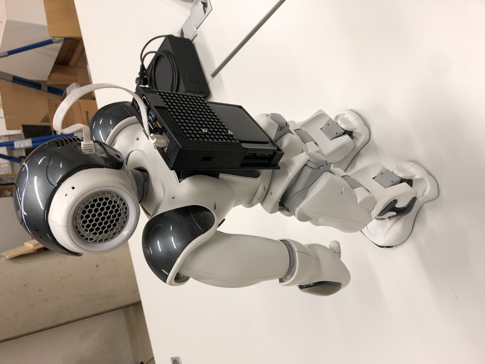

# Nano-backpack for NAO robot


Nano-backpack is an open hardware add-on for the humanoid robot NAO. It adds
a Nvidia Jetson Nano development board to the robot and thereby enhances the computational capabilities of the system. The corresponding software architecture includes
a webapp to control the robot and allows an easy start into the development of further
applications.

This project was part of the Robotics Practical class (MScTI_ROBP) in summer term 2020 @ Heidelberg University.

## Setup:
<details><summary><b>Install and setup linux-wifi-hotspot on Jetson Nano</b></summary>

1. Install dependencies:

    ```sh
    sudo apt install -y libgtk-3-dev build-essential gcc g++ pkg-config make hostapd
    ```
2. Clone repo and build:

    ```sh
    git clone https://github.com/lakinduakash/linux-wifi-hotspot
    cd linux-wifi-hotspot

    # build binaries
    make

    # install
    sudo make install
    ```
3. Open application and create hotspot with `rndis0` preset
4. Run linux-wifi-hotspot on every startup:
    ```sh
    systemctl enable create_ap
    ```
</details>
<details><summary><b>Clone this repo and build Docker Image</b></summary>

1. Clone:
    ```sh
    git clone https://github.com/roydenwa/nano-backpack.git
    ```
2. Navigate to nano-backpack/src/app/ and build Docker image with:
    ```sh
    sudo docker build -t "nano-backpack" .
    ```
</details>
<details><summary><b>Install and run dnsmasq</b></summary>

1. Install dnsmasq:
    ```sh
    apt install dnsmasq
    ```
2. Run provided bash script to setup a subnet:
    ```sh
    sudo bash run_dnsmasq.sh
    ```
</details>
<details><summary><b>Run Docker image and connect to wifi-hotspot to see webapp with other devices</b></summary>

Start Docker image with interactive shell:
    `
    sudo docker run --rm -it -p 80:80 "nano-backpack"
    `
The webapp should now be visible at `192.168.12.1` if you are connected to the previously created wifi hotspot.
</details>
 
## License and credits
<a rel="license" href="http://creativecommons.org/licenses/by/4.0/"></a><br />This work is licensed under a <a rel="license" href="http://creativecommons.org/licenses/by/4.0/">Creative Commons Attribution 4.0 International License</a>.

This repo is built upon other open-source contributions:

* CAD models are partially based on [NAO-backpack](https://github.com/uchile-robotics/nao-backpack).
* The wifi hotspot is created with [linux-wifi-hotspot](https://github.com/lakinduakash/linux-wifi-hotspot).
* The unfinished concept for monocular depth estimation is based on [DenseDepth](https://github.com/ialhashim/DenseDepth).

## TODO:
- [ ] Docu
   - [x] Simplify Layout - Alex frist page - abstract and contents, header
    - [x] Abstract
    - [X] Introduction - Alex / Royden
    - [x] Related works Backpack - Alex
    - [X] Related works Monocular - Royden 
    - [ ] Related Works optional: linux-wifi-hotstpot ? - Royden
    - [ ] Instructions for Peter - Peter how to - Alex
        - [x] pw user on Nano
        - [x] pw wlan nano-bp
        - [x] ip ssh
        - [x] standard ip NAO robot
        - [x] Table compatible Naoqi-SDKs (Offical: Python: no(not suitable for ARM), Javascript: qimessaging yes, qi2: yes, C++: not tested, Third-party: ROS: deprecated,   NodeJs~yorki: yes)
        - [ ] Development Environment Nano:
        - [x] how to use docker and python on Nano with NAO
   - [X] Mechanical design - Royden
   - [X] Remote control NAO ~ UI5 - Royden / Alex
   - [X] Depth estimation - python-decorator - single-frame <-> video - Royden
   - [X] Conclusion: - Alex / Royden
      - [ ] benefit: easy start - dev env - UI for for testing
      - [ ] outlook: python base for depthestimation, JS base for more NAOqi-services
- [ ] App
   - [x] NAOs view - placeholder img of NAO - Alex
   - [X] ui5-datamodel ip, text params - Royden
   - [X] Import Error qimessaging - Royden
   - [ ] update readme, clean repo 
   - [X] Docker images - Royden
